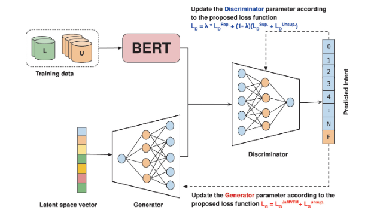
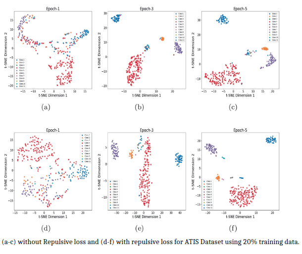

# JAMVFM-SSGAN
# Joint-Average Mean and Variance Feature Matching (JAMVFM) Semi-supervised GAN  
## Additional-Objective Training Function for Intent Detection  

### 📌 Overview  
This repository contains the official implementation of the paper:  
**"Joint-Average Mean and Variance Feature Matching (JAMVFM) Semi-supervised GAN with Additional-Objective Training Function for Intent Detection."**  

Our approach enhances **intent detection** by incorporating:  
✅ A **GAN-based semi-supervised learning model**  
✅ A novel **JAMVFM feature-matching technique**  
✅ An **additional-objective training function** for improved performance  

### 📄 Paper  
🔗 [https://link.springer.com/chapter/10.1007/978-3-031-70566-3_24]  

---

## 🚀 Features  
- **JAMVFM Feature Matching**: Uses mean & variance for better feature alignment  
- **Semi-supervised GAN**: Utilizes labeled & unlabeled data effectively  
- **Additional-Objective Function**: Enhances GAN optimization  
- **Benchmark Evaluation**: Tested on standard intent detection datasets  

---

## 📂 Repository Structure  
```bash
📂 JAMVFM-SemiGAN  
│── 📂 data/              # Datasets for intent detection  
│── 📄 requirements.txt   # Dependencies for running the code  
│── 📄 README.md          # Repository documentation  
│── 📄 LICENSE            # License information  
│── 📄 train.py           # Main script for training the model  
│── 📄 results.md         # Experimental results and findings  


##  Installation
### System requirements
OpenSLU requires `Python>=3.8`, and `torch>=1.12.0`.
### Install from git
```bash 
git clone https://github.com/anketvit1/Few-shot-PLM.git && cd Few-shot-PLM/
pip install -r requirements.txt
```
## 📄 Paper Results  
Here is a visual representation of the results from my published research paper:  




##  Reference

If you find this project useful for your research, please consider citing the following paper:

```
@inproceedings{kumar2024joint,
  title={Joint-Average Mean and Variance Feature Matching (JAMVFM) Semi-supervised GAN with Additional-Objective Training Function for Intent Detection},
  author={Kumar, Ankit and Georges, Munir},
  booktitle={International Conference on Text, Speech, and Dialogue},
  pages={275--287},
  year={2024},
  organization={Springer}
}

```
